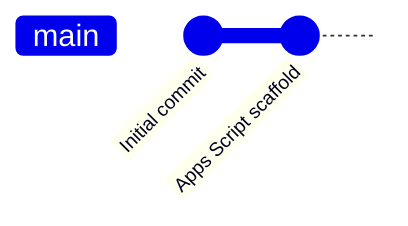
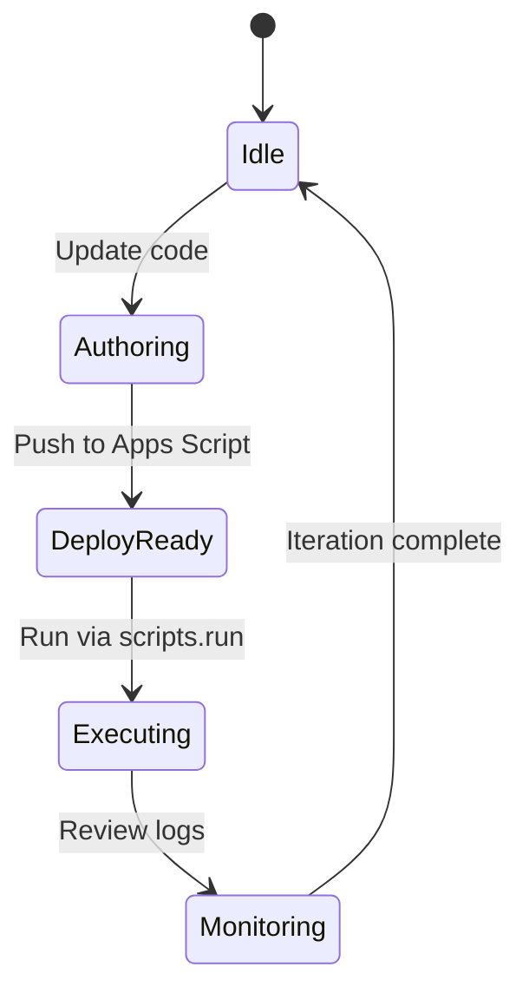
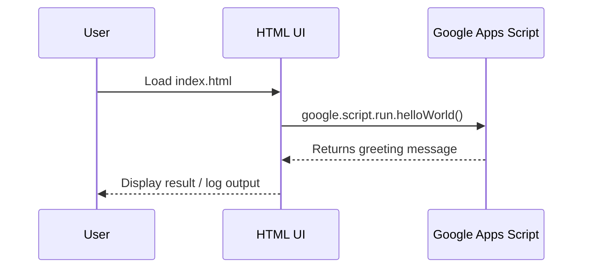
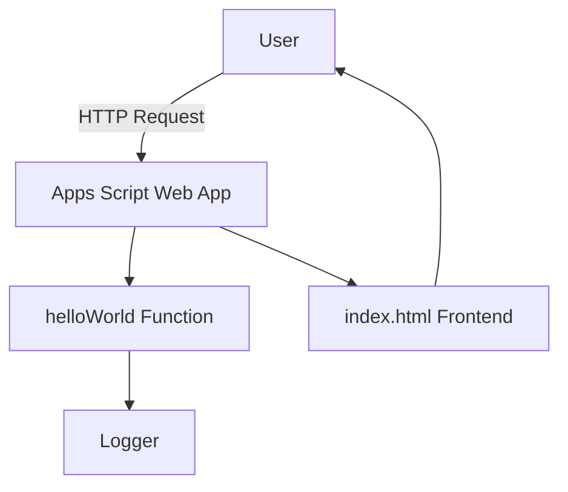
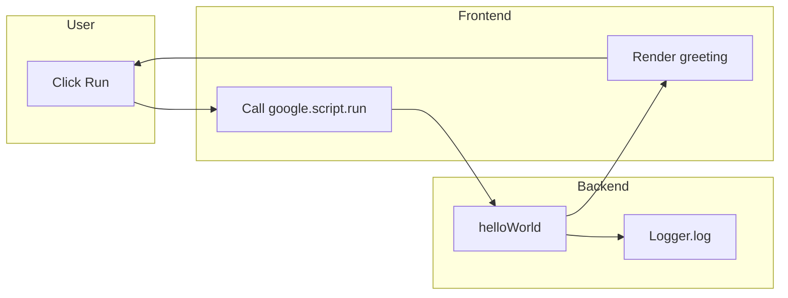

# GAS

This repository contains a minimal Google Apps Script project scaffold ready for deployment with `deploy.js` or `clasp`. The script exposes a globally accessible `helloWorld()` function that logs and returns a greeting, making it suitable for invocation through `scripts.run` or as a web app entry point.

## Project Structure

- `src/appsscript.json`: Base Apps Script manifest with timezone, runtime, and logging configuration.
- `src/Code.gs`: Server-side script file exposing `helloWorld()`.
- `src/index.html`: Frontend view that can be served by a web app deployment.

## Usage

1. Update or extend the scripts within `src/` as needed.
2. Deploy using your preferred workflow (`clasp`, `deploy.js`, etc.).
3. Invoke `helloWorld()` via `scripts.run` or by loading the web app to confirm the setup.
