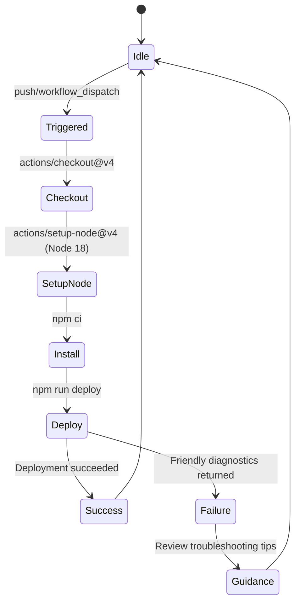
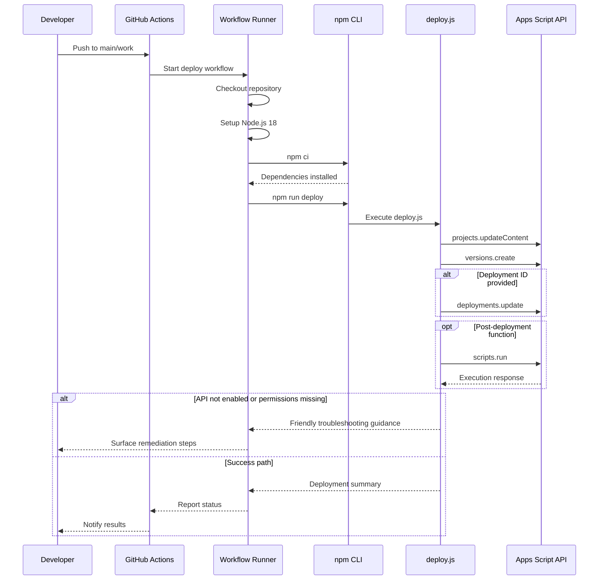
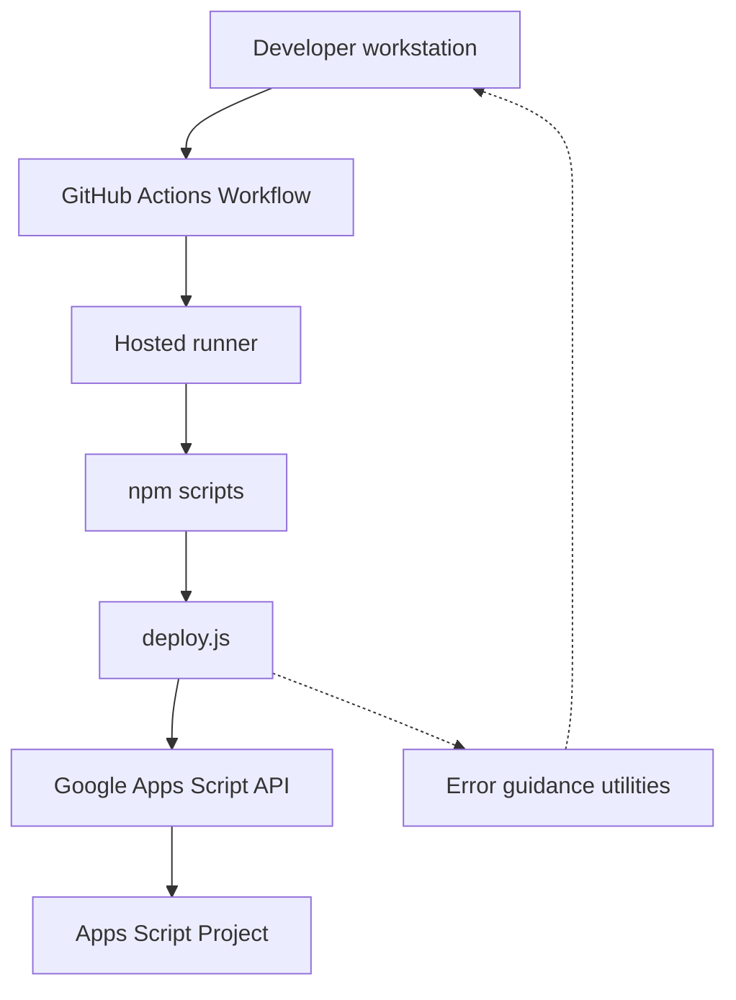
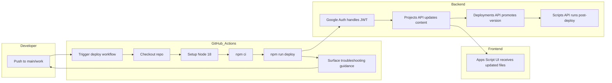

# GAS

```mermaid
gitGraph
    commit id: "Initial commit"
    branch main
    checkout main
    branch work
    checkout work
    branch codex/setup-google-apps-script-project-structure
    checkout codex/setup-google-apps-script-project-structure
    commit id: "Add Apps Script deployment automation"
    commit id: "Add initial Apps Script scaffold"
    checkout work
    merge codex/setup-google-apps-script-project-structure id: "Merge PR #1"
    branch codex/initialize-package.json-and-create-deploy-script
    checkout codex/initialize-package.json-and-create-deploy-script
    merge main id: "Sync main into feature"
    checkout work
    merge codex/initialize-package.json-and-create-deploy-script id: "Merge PR #2"
    commit id: "Add Actions deploy workflow"
    commit id: "Improve deployment error diagnostics"
```









## Overview

This repository provides a lightweight deployment utility for Google Apps Script projects. The workflow packages the contents of the local `src/` directory and publishes them to an Apps Script project using a service account.

## Prerequisites

- Node.js 18 or later.
- A Google Cloud project with the Apps Script API enabled.
- A service account JSON key with access to the Apps Script project.

## Environment Variables

| Variable | Required | Description |
| --- | --- | --- |
| `APPS_SCRIPT_ID` | ✅ | Target Apps Script project ID. |
| `GCP_SERVICE_ACCOUNT_KEY` | ✅ | Service account key JSON string or base64-encoded JSON. |
| `APPS_SCRIPT_DEPLOYMENT_ID` | ➖ | Deployment ID to promote after creating a new version. |
| `APPS_SCRIPT_RUN_FUNCTION` | ➖ | Function name to invoke via `scripts.run` after deployment. |
| `APPS_SCRIPT_RUN_PARAMETERS` | ➖ | JSON array (or single value) of parameters for the post-deployment function. |

## Troubleshooting

- **Apps Script API disabled** – When the workflow reports a `PERMISSION_DENIED` error and advises enabling the Apps Script API, sign in to the target account and toggle on the API at [https://script.google.com/home/usersettings](https://script.google.com/home/usersettings) before retrying.
- **Missing secrets** – If `APPS_SCRIPT_ID` or `GCP_SERVICE_ACCOUNT_KEY` is absent, the deployment halts immediately. Double-check the GitHub Actions secrets or your local environment variables.

## Usage

1. Place your Apps Script sources under the `src/` directory (`.gs`, `.js`, `.html`, and `appsscript.json`).
2. Export your service account key JSON and store it in `GCP_SERVICE_ACCOUNT_KEY` (raw JSON or base64 encoded).
3. Run the deployment:

   ```bash
   npm run deploy
   ```

The script will upload the file payload, create a new version, optionally update a deployment, and optionally execute a post-deployment function.

## Deployment Flow

1. **Content Update** – The `files` payload is generated from the `src/` directory and sent via `projects.updateContent`.
2. **Versioning** – A descriptive version is created through `projects.versions.create` to preserve a checkpoint.
3. **Deployment Promotion** – If `APPS_SCRIPT_DEPLOYMENT_ID` is provided, the deployment is updated to the newly created version.
4. **Post-Deployment Automation** – When `APPS_SCRIPT_RUN_FUNCTION` is set, the specified function is invoked by `scripts.run` with optional parameters.

## Development Notes

- The service account key can be provided as either raw JSON or base64-encoded JSON. Invalid payloads are rejected with a descriptive error.
- Missing `appsscript.json` files trigger a warning because Apps Script deployments rely on the manifest.
- Empty `src/` directories are allowed but will result in a warning that the remote project could be cleared.

## License

ISC
